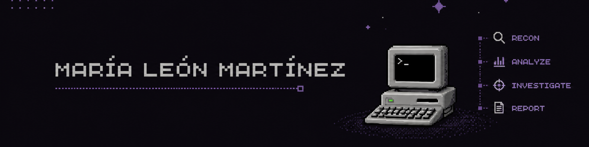

  

<h1 align="center">María León Martínez</h1>

  

  
  
  

 

---

## 👩‍💻 Perfil Profesional

Soy María, Técnica Superior en Administración de Sistemas Informáticos en Red con una especial pasión por la Ciberseguridad.

Combino conocimientos defensivos (**Blue Team / SOC**) y técnicas ofensivas (**Red Team / OSINT**) para mejorar la seguridad global.

Experiencia en:

* Monitorización
* Respuesta ante incidentes
* Hardening de sistemas (**Linux/Windows**)
* Desarrollo de automatizaciones en **Python**
* Optimización de flujos de **SecOps**

---

## 🛡️ Enfoque Purple Team

### 🔵 Blue Team

**Defensa & Detección**

**Hardening**
Sistemas Linux, Windows, Active Directory y GPOs.

**SecOps & SIEM**
Monitorización de logs, gestión de incidentes y detección de vulnerabilidades.

**Infraestructura**
Administración de redes (TCP/IP, DNS/DHCP) y virtualización (VMware, VirtualBox).

---

### 🔴 Red Team & OSINT

**Simulación & Recon**

**OSINT & Threat Intel**
Recolección de información pública, análisis de amenazas y perfilado.

**Hacking Ético**
Evaluación de vulnerabilidades e investigación de vectores de ataque.

**Automatización**
Desarrollo de scripts y herramientas de análisis en Python.

---

## 💼 Experiencia Laboral

### Desarrolladora Web

**Enkross** · `2024 - 2025`

* Desarrollo de aplicaciones web y de escritorio en Python para la automatización de procesos internos.
* Implementación de scripting para la optimización de tareas operativas y de seguridad.

---

### Técnica de Sistemas & SAP

**Capgemini** · `2023`

* Gestión de incidencias, monitorización y análisis de logs de sistema.
* Supervisión de la infraestructura técnica y administración de entornos SAP.

---

## ⚙️ Stack Técnico

### Tecnologías

  

### Especialidades Técnicas

**Defensive Operations**
`Incident Response` · `Log Analysis`

**Networking & Systems**
`Active Directory` · `TCP/IP` · `DNS` · `DHCP` · `VirtualBox` · `VMware`

**Scripting & Dev**
`Python Automation` · `Bash Scripting` · `Web Dev`

**OSINT & Intelligence**
`Reconocimiento` · `Fuentes Abiertas` · `OSINT Frameworks`

---

## 🎓 Formación Académica

### Máster en Ciberseguridad y Hacking Ético

**Big School** · `2026`

---

### Máster Ciberseguridad e Inteligencia Artificial (IA)

**CEI** · `2025 - 2026`

---

### GS Administrador de Sistemas (ASIR)

**Linkia FP** · `Perfil Ciberseguridad`

---

   
  <b>🔐 Purple Team · Cybersecurity · Systems · OSINT · Automation</b>

